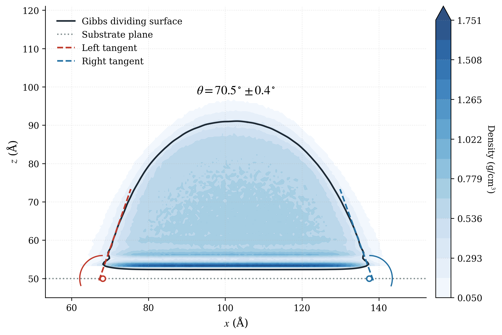
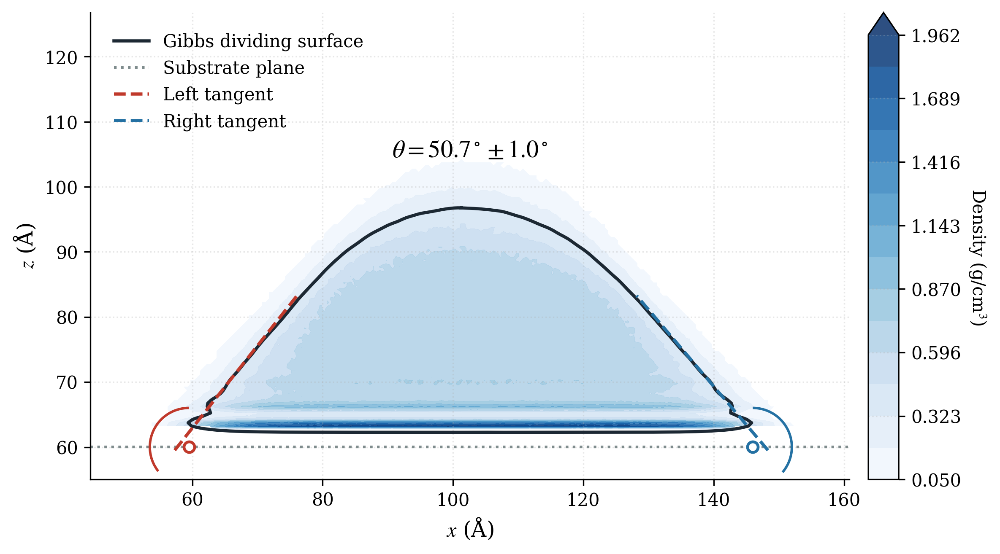
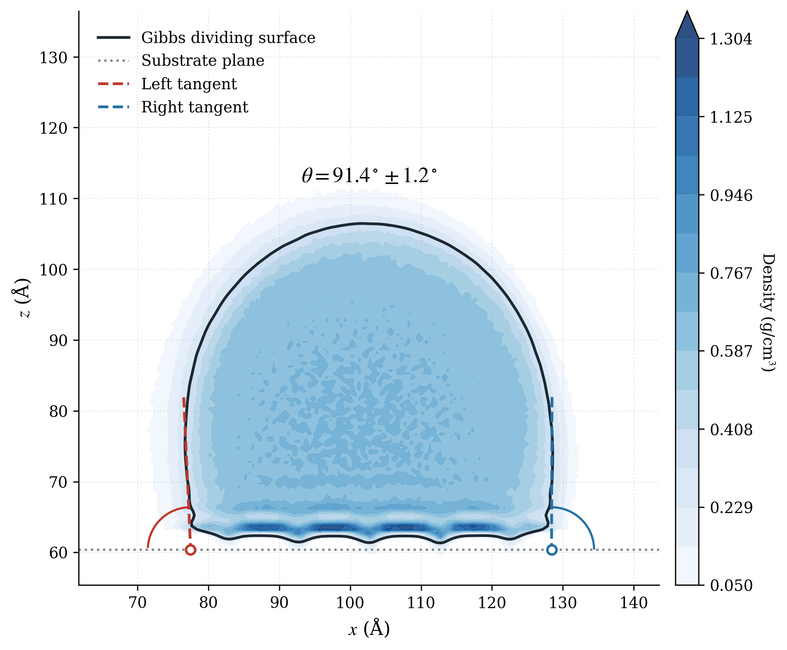
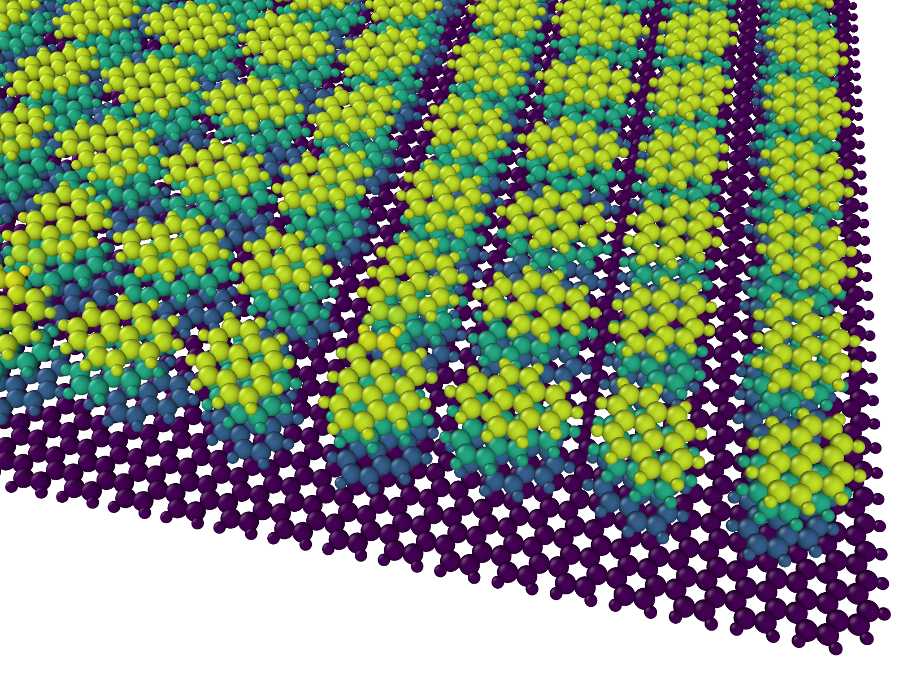
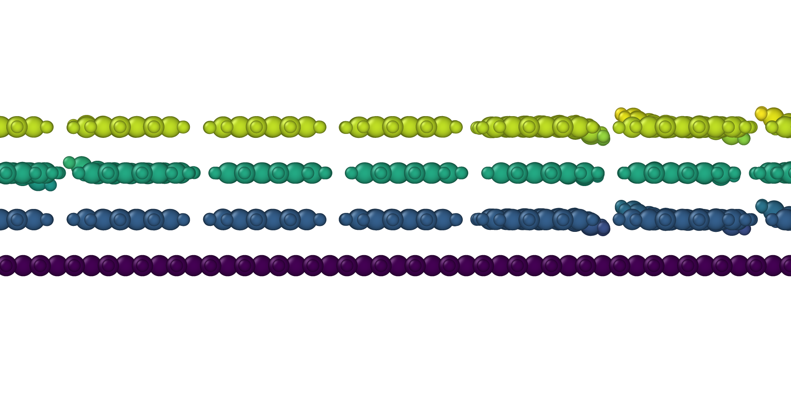

# LAMMPS Workspace: Graphene & MXenes Wetting

Molecular Dynamics (MD) simulation scripts and analysis tools for studying surface wettability, contact angles, and density profiles of water droplets on substrates (Graphene, Graphite, Structured Graphite, and MXenes).

## Overview
This repository provides a fully automated pipeline: from building atomistic substrate geometries and water boxes to running LAMMPS equilibration and extracting the final contact angle using Object-Oriented Python analysis.

## Key Findings: Wetting Phenomena

By employing robust density profile extraction and local tangent fitting with iterative sigma-clipping, the true macroscopic contact angles were determined for carbon substrates:

| System | Contact Angle (θ) | Physical Phenomenon |
| :--- | :---: | :--- |
| **Graphene** (1L) | **70.5° ± 0.4°** | **Base state:** Monolayer carbon exhibits weak hydrophilicity. |
| **Graphite** (Bulk) | **50.7° ± 1.0°** | **Wetting Transparency Breakdown:** Increased van der Waals attraction from subsurface layers makes bulk graphite highly hydrophilic. |
| **Structured Graphite** | **91.4° ± 1.2°** | **Cassie-Baxter Transition:** Nanotexturing drastically reduces the solid-liquid contact area, shifting the surface to a hydrophobic state. |

### Visual Analysis (Density Heatmaps)
<p align="center">
  
  
  
</p>

### Atomistic Representation
3D morphology and cross-sectional view of the structured graphite substrate.
<p align="center">
  
  
</p>

---

## Methodology Pipeline

The simulation workflow is strictly organized into logical steps to ensure high reproducibility:

1. **Geometry Assembly:** Initial configurations (water droplets & carbon substrates) are built using ASE and Packmol.
2. **Substrate Preparation:** 0 K energy minimization (FIRE/CG) with frozen anchor atoms to prevent edge and pillar deformation.
3. **MD Simulation:** Performed in LAMMPS (NVT ensemble, Langevin thermostat at 300 K). A `fix momentum` command is applied to the center of mass to prevent unphysical Brownian drift and edge-pinning (superlubricity effect) during the 2 ns production run.
4. **Data Extraction:** The 2D density map is extracted from the production trajectory using `chunk/ave`.
5. **Contact Angle Calculation:** Custom OOP Python script defining the Gibbs dividing surface (ρ = 50% bulk) and extracting the macroscopic angle using an extrapolated linear fit.

## System Setup
Runs on a remote Ubuntu workstation (Ryzen 7 8700F + RTX 5070 Ti).  
Workflow: VS Code Remote via SSH/Tailscale.

### LAMMPS Build Info
LAMMPS is compiled locally with **OpenCL** support to bypass CUDA compatibility issues with the Blackwell architecture.

* **GPU Backend:** OpenCL (Selected for RTX 5070 Ti support)
* **Compiler:** GCC-12 / G++-12
* **MPI:** OpenMPI
* **Packages:** MOLECULE, KSPACE, MANYBODY, MISC, RIGID

### Running Simulations
Using 8 MPI threads + GPU acceleration via custom alias:
```bash
# 'lmpgpu' is aliased to: mpirun -np 8 /path/to/lmp -sf gpu -pk gpu 1
lmpgpu -var geom graphene -in scripts/04_analysis/equilibration.in
```

## Python Environment
Used for automated geometry generation, extracting Gibbs dividing surfaces from LAMMPS density maps, least-squares contact angle fitting, and rendering heatmaps.

```bash
source venv/bin/activate
pip install -r requirements.txt
```
## Project Structure & Pipeline
The simulation workflow is strictly organized into logical steps:
```text
.
├── scripts/               # Core simulation pipeline
│   ├── 01_substrate/      # Python builders & LAMMPS minimization for solid surfaces
│   ├── 02_water/          # Water droplet generation (Packmol/Python) & relaxation
│   ├── 03_assembly/       # Merging the droplet onto the substrate
│   └── 04_analysis/       # Main MD runs (equilibration, density grids) and Contact Angle math
├── data/                  # Geometries (.data, .xyz) and density fields (.dat)
├── dump/                  # Trajectory files (*.lammpstrj) (Ignored by Git)
├── output/                # Rendered plots, heatmaps, and analysis logs
├── requirements.txt       # Python dependencies
└── README.md
```
